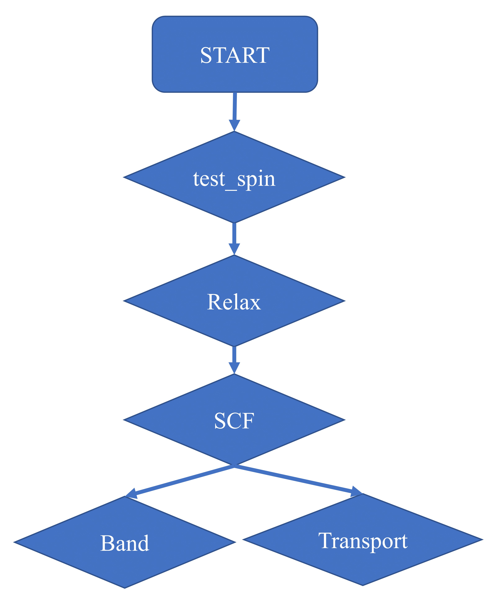

# MIP high-throuput workflow scripts
The script [`run_pbe.lsf`](./run_pbe.lsf) is used for the high-throuput calculation in MIP.
The workflow of this script is as below:

<div align=center>

<!--  -->
</div>

The input of this script is `POSCAR` and `INCAR.*`, then you can submit this script to your server.

It is written in Shell script, so it is easy to use.

# Dependencies
Before using it, you should make sure some dependent scripts is work.

## 1. Three linux scripts needed, inculding `GETPOTCARPAW`, `GETINCAR` and `GETBANDK.sh`, 

### [GETPOTCARPAW](./program/GETPOTCARPAW)
Generate `POTCAR` file. Need to modify the `PAW` file path and `POTCAR folder` path before use.
- Input

    `POSCAR`: Elements row in POSCAR is needed.

    [PAW](./program/GETPOTCARPAW): This file contains all elements and corresponding POTCAR name.
- Output

    `POTCAR` 


### [GETINCAR](./program/GETINCAR)
 `GETINCAR` is for LDA+U calculations. Need to modify the `LDAU` file path before use.
- Input

    `POSCAR`: Elements row in POSCAR is needed.

    [LDAU](./program/LDAU): This file contains elements and corresponding U value.
- Output

    Add tags for LDA+U calculation to `ICNAR` file. 

### [GETBANDK.sh](./program/GETBANDK.sh)
 Generate `KPOINSTS.band` file. The `KPOINSTS.band` file is a line mode K-points file used for band calculation.
 This script need `phonopy-1.12` to get `space_group_number` (the variable `${spacegroup}` in the script need this value) and `space_group_type` (for variable `${symbol}`). (For different versions of `phonopy`, you need to modify the script to get the correct value.)
- Input:
    
    `POSCAR`
- Output

    `KPOINTS.band`: Copy `KPOINTS.band` to `KPOINTS` to run band calculation.

## 2. Some programs are needed

### [lattice_parameters](./program/lattice_parameters)
 Get lattice parameters from `POSCAR`.
- Compiler:

    `ifort -o lattice_parameters lattice_parameters.f90`
- Input:

    `POSCAR`
- Output:

    Lattice parameters.


### [getgap](./program/getgap/getgap)
 Get band gap. 
- Compiler: 
    
    `ifort -o getgap getgap.f90`

- Input:

    `OUTCAR`, `EIGENVAL`
- Output:

    Band gap.
    
    `gap.txt` file contans the values and k-points for VBM and CBM. 

### [dospar](./program/dos/dospar) 
Density of states (DOS) analysis.
- Compiler:
    
    `make dospar`
- Input files:

    `EIGENVAL`, `OUTCAR`, `PROCAR`

- Input parameters (after running `dospar`, you need to enter some parameters. Here is a running example):

    ```console
    The energy for zero point is: (# fermi energy)

    -1.90

    The energy starts from (with respect to zero point):

    -3

    The energy step is:

    0.01

    How many points in this energy step? 

    600

    Tell the temperature entering the Fermi-Dirac function: (# change the temperature can generate the projected DOS with different smearing.)

    300

    What scissors for band gap?(T/F)

    F

    Want to split the d orbitals(i.e. t2g & eg)? (T/F)

    T

    Want partial dos for special atoms?(T/F)

    F

    Want partial dos for each type of atoms? (T/F)

    T
    ```

- Output:

    `tdos.txt`: total DOS.

    `element.txt`: PDOS for each element.

### [chgsum.pl](./program/chgsum.pl) and [bader](./program/bader)
 For Bader Charge analysis. For more infomation please refer to http://theory.cm.utexas.edu/henkelman/code/bader/

- Input:

    `AECCAR0`, `AECCAR2`, `CHGCAR`
- Output:

    `ACF.dat`

### [TransOpt](https://github.com/yangjio4849/TransOpt.git)
 Calculate electrical transport properties. For more infomation to this softerware, please refer to https://github.com/yangjio4849/TransOpt.git

# Use the script.

After ensuring that all the above dependent scripts and programs are available, modify the job management system and the VASP in the script to adapt to your server. Then you can submit the script.

For example:
```ini
$ ls
vasp_pbe.lsf POSCAR INCAR.SCF.pbe  INCAR.band.pbe  INCAR.relax.coarse.pbe  INCAR.relax.fine.pbe  INCAR.test.pbe  INCAR.test_ferro.pbe
$ bsub < vasp_pbe.lsf
```